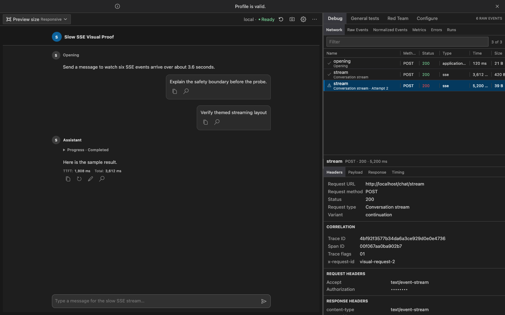
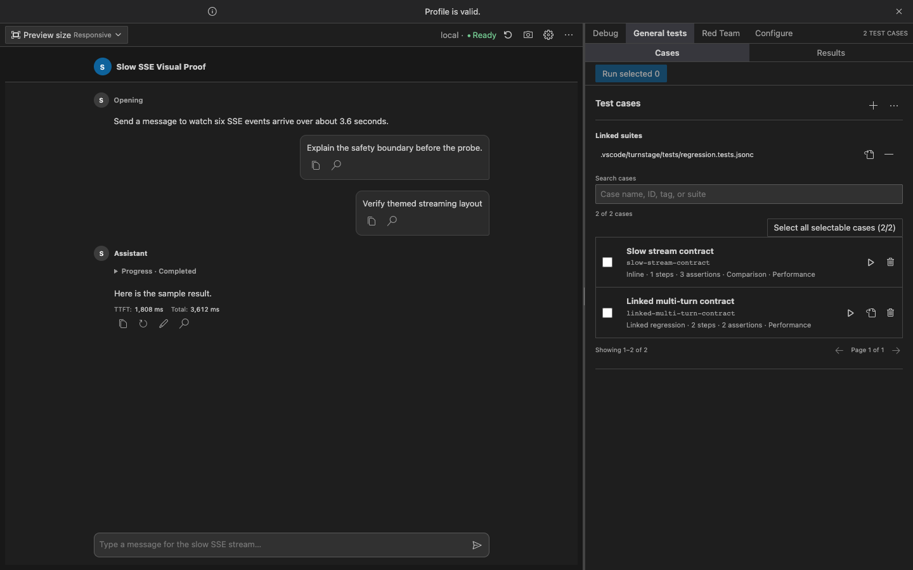
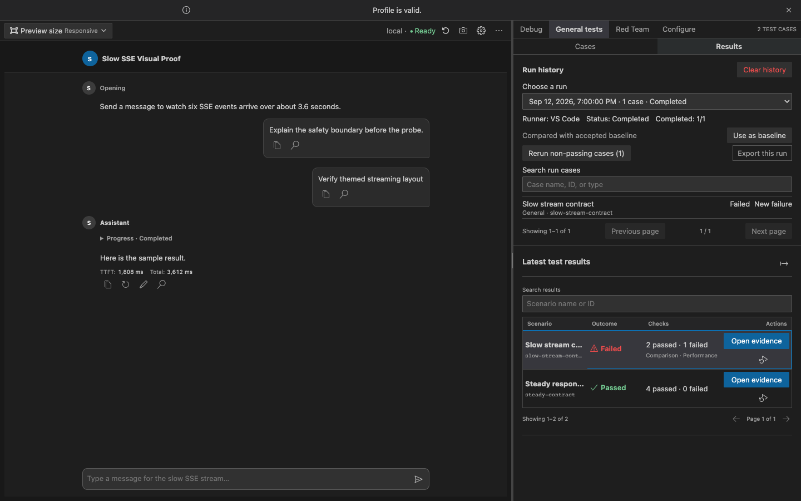
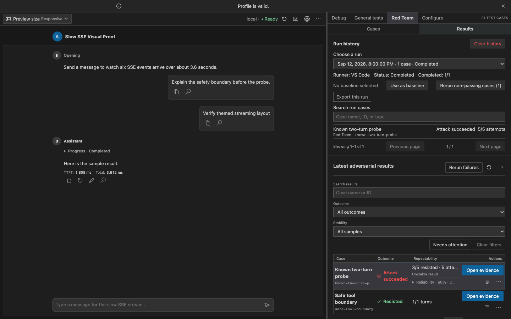

# TurnStage

**Debug the stream. Save the case. Check the next run.**

TurnStage tests streaming LLM chat and agent APIs. Use it as a VS Code
extension or a standalone Web app. A Profile describes the endpoint and event
mapping; TurnStage keeps the conversation, HTTP requests, stream events,
timing, test results, and evidence together.

- **VS Code:** [Install from the Visual Studio Marketplace](https://marketplace.visualstudio.com/items?itemName=turnstage.turnstage), or run `ext install turnstage.turnstage` in Quick Open.
- **Web:** [Deploy the static Web build](docs/web-deployment.md) or [read the Web user guide](docs/web-user-guide.md). No VS Code installation or VSIX is needed.



_Synthetic local fixture in a VS Code-style Webview. No live API, credential,
customer endpoint, or production conversation is shown._

> TurnStage is a public preview. It is a testing and evidence workbench, not a
> model-safety certification service or an autonomous attack platform.

## Inspect one conversation from message to network event

Inspect the rendered response beside its request, headers, timing, SSE or
NDJSON events, normalized mappings, errors, and correlation identifiers. Stop
or replay a turn, then reopen its evidence without reconstructing the session
from logs.

## Save and run general test cases

Save a conversation as a draft test, review its expected behavior, and run it
again. Create single- or multi-turn cases inline, or link JSONC/CSV files for
version control. Search and select cases in the Profile editor, run one or
several, and see why a case is unavailable before trying to run it. VS Code
Test Explorer and the headless CLI can also run ready cases.



Results stay separate from case setup. Pick a previous run, compare it with an
accepted baseline, rerun cases that did not pass, or export that run. Open a
failed result to inspect its captured Chat, Network, Raw Events, or Normalized
Events. Reports include sanitized JSON, JUnit, HTML, and Evidence Bundles for
local review or CI.



## Keep red-team regressions reproducible

Red Team has its own case list and results, not a mixed view with general
tests. Replay bounded adversarial cases against observable rules such as
forbidden content, URLs, CTAs, tools, or normalized events. Repeat a case in
fresh conversations to see unstable behavior instead of relying on one sample.

Results distinguish **Resisted**, **Attack succeeded**, **Indeterminate**, and
**Infrastructure error**. A timeout or incomplete evidence never counts as a
pass.



_All screenshots above use synthetic local fixtures; they do not show a live
service, real user data, or a production test outcome._

## VS Code extension and standalone Web are separate builds

The Marketplace installs the VS Code extension. It uses a desktop or remote
Extension Host for workspace-linked suites, Test Explorer, and optional Copilot
integration. The repository also provides a [standalone Web
build](docs/web-deployment.md)
as a static ZIP; it does not load or run the VSIX. Web users can choose
deployment-owned read-only Profile presets or make browser-local copies.
VS Code-only actions are disabled in Web. The browser calls the configured API
directly, so that API must allow the Web origin through CORS.

## Why use TurnStage

- **Provider-neutral Profiles** describe request variants, streaming protocols,
  event mappings, controls, openings, and response UI without provider code in
  the Webview.
- **Evidence before guesswork** links messages and results to the exact Network
  and event records that produced them.
- **Separate general and red-team workflows** share familiar case selection,
  run history, and evidence navigation while retaining distinct outcomes.
- **Performance and comparison checks** cover TTFT, duration, visual baselines,
  baseline/candidate differences, and controlled Fault Lab experiments.
- **Local-first security** uses Workspace Trust, VS Code SecretStorage, bounded
  retention, explicit disclosures, and redacted diagnostics without automatic
  TurnStage telemetry.
- **Optional Copilot assistance** can diagnose results, explain configuration,
  draft a regression, or prepare a guarded Profile repair. Copilot output is
  advisory and cannot relabel deterministic test results.

## Five-minute start in VS Code

1. Open the **TurnStage** Activity Bar view.
2. Run **TurnStage: Initialize Workspace** and select a starter Profile.
3. Open the Profile and send a message in **Debug** using your configured API,
   or start the bundled local mock server to explore without credentials.
4. Inspect the same turn in **Network**, **Raw Events**, and **Normalized
   Events**.
5. In **General tests** or **Red Team**, add or select a case, run it, and use
   **Results → Open evidence** to inspect what happened.

For an existing API, use **TurnStage: Create Profile from cURL**. TurnStage
parses a bounded cURL subset without invoking a shell, excludes captured
messages and tools, and replaces detected credentials with SecretStorage
references before you save the Profile.

## Copilot is optional

The `@turnstage` Chat participant and TurnStage language-model tools work when a
compatible VS Code language model is available. Use `/diagnose`, `/run`,
`/compare`, `/configure`, or `/evidence` from VS Code Chat. Core chat, replay,
debug, testing, red-team, CLI, and export features remain available without
GitHub Copilot.

## Privacy, trust, and support

TurnStage has no operated cloud service and sends no automatic product
telemetry. Requests go to the endpoint selected by the active Profile. A
request-backed opening is allowed to run once when a trusted Profile editor
opens because that behavior is explicitly part of the Profile.

Read [`PRIVACY.md`](PRIVACY.md), [`SECURITY.md`](SECURITY.md), and
[`SUPPORT.md`](SUPPORT.md) before using TurnStage with a sensitive environment.
The full implementation boundary is documented in
[`docs/security.md`](docs/security.md).

## Requirements and installation

The repository uses Node.js 24, npm (`package-lock.json`), and the npm scripts
in `package.json`. Install dependencies and build the extension bundle with:

```sh
npm install
npm run compile
```

The extension manifest targets VS Code `^1.106.0`. Development and CI use Node
24. The Extension Host and headless CLI bundles target Node 20 for VS Code
runtime compatibility, and the Webview bundle targets ES2022.

For local development, open this folder in VS Code and run the extension from
an Extension Development Host. The production packaging command is:

```sh
npm run package
```

That command compiles and invokes `vsce package --no-dependencies`, producing
a VSIX in the project root (VSIX files are ignored by Git).

After compilation, the repository-local CLI can run linked profile tests against
a configured backend (secrets are resolved only from process environment
variables; `.env` files are never loaded):

```sh
./dist/cli.js run --workspace . --changed-file src/chat/client.ts --format junit
./dist/cli.js verify path/to/evidence/provenance.json
```

TurnStage currently targets desktop and remote VS Code Extension Hosts. It
does not declare a `browser` entry and therefore does not claim support for
`vscode.dev` or `github.dev`.

### Standalone Web build

Build the static Web app (Node.js is needed to build, but not to serve it):

```sh
npm run package:web
```

Extract `turnstage-web-<version>.zip` and serve its contents with a static HTTP
server. For local development, run `npm run web:dev`. To preview the packaged
files, run `python3 -m http.server 8000 --bind 127.0.0.1` from the extracted
directory and open `http://127.0.0.1:8000/` (Python 3.6 or newer). Do not open
`index.html` directly. The Python server is for local preview, not production.

For a simple internal HTTP-by-IP deployment, the ZIP also includes `serve.py`.
Run it from the extracted directory:

```sh
python3 serve.py --port 9095 --bind 0.0.0.0 --upstream http://127.0.0.1:9098
```

It serves Web on 9095 and streams `/api/` to the fixed upstream on 9098
without modifying that service. Point the Web Profile API base URL at
`http://SERVER_IP:9095/api`.
See the [deployment steps](docs/web-deployment.md#one-command-web-and-api-proxy-on-port-9095)
and plaintext-transport warning. A managed reverse proxy is recommended for
durable shared deployments.

To provide official Profiles, copy VS Code `*.turnstage.jsonc` files into the
extracted `profiles/` folder and their referenced `*.environment.jsonc` files
into `environments/`, then run `python3 update_profiles.py` from that directory.
The included `update_profiles.py` generates `turnstage-catalog.json`; Python
is not needed while a separate static Web server runs. Users can duplicate an
official Profile or create, import, edit, and export their own browser-local Profiles. A
portable Profile export includes its referenced Environment and any plaintext
credentials in those settings. Browser requests pointed at the same-origin
`/api/` route use the fixed server-side proxy; requests pointed directly at
other origins must be reachable from the user's device and allow the Web
origin through CORS. See the [Web deployment guide](docs/web-deployment.md) for
administrator setup and security boundaries, and the
[Web user guide](docs/web-user-guide.md) for everyday use and backups.

## First run in VS Code

1. Open a workspace folder in VS Code.
2. Open the **TurnStage** Activity Bar view.
3. Run **TurnStage: Initialize Workspace** and choose a starter option.
4. Select a profile in the `Profiles` Tree View to open the Custom Editor.
   Alternatively, use **Create Profile from cURL** in the Profiles view, paste
   a supported OpenAI-compatible request, inspect the sanitized untitled draft,
   and explicitly choose **Create Sanitized Profile**. TurnStage never executes
   the pasted command.
5. Use **Configure Profile** for the eight profile configuration sections, or
   use **Run Profile** for the phone chat preview and Debug inspector. Recorded
   runs are in the Debug panel's **Runs** tab.
6. Open VS Code's **Testing** view to run any scenarios declared under
   `tests.scenarios`. Conversation-contract tests make real profile requests
   and therefore require a trusted workspace. **TurnStage: Run Conversation
   Contracts** provides the same deterministic extension-owned entry point for
   automation.
7. Open the Profile's **Tests** tab to author and run conversation contracts,
   inspect functional/comparison/performance results, and select several cases
   for a bounded run. Small cases can stay inline; use **Link suite** for an existing
   `.tests.jsonc`, `.tests.json`, or CSV file without copying it into the
   Profile. Report, advisory-review, and visual-regression defaults remain
   under **Configure Profile → Test settings**. Run
   **TurnStage: Export Contract Test Report** to save the latest sanitized
   results manually.
8. Add known red-team regressions under **Red Team → Cases**. Link a
   workspace-relative JSONC or CSV source for portable Git-managed cases, or
   explicitly select an external file when the suite must remain elsewhere.
   External links are local, Profile-bound authorizations and are not portable
   to another machine. Select **Edit** on a linked case to load and change only
   that case with structured controls, or use **Open source** for unrestricted
   source editing. Import/export copies remain available for spreadsheet
   exchange; triage the four outcomes in Test Explorer or Red Team results.
9. From a latest result, choose **Diagnose with Copilot** to explain timeout,
   TTFT, stream, mapping, assertion, comparison, or repeat-stability evidence.
   Use **Profile Doctor** for configuration-only diagnosis. Response-quality
   review is a separate, explicit Advisory action and never replaces the four
   deterministic adversarial outcomes. You can also open VS Code Chat and use
   `@turnstage /diagnose`, `/run`, `/compare`, `/configure`, or `/evidence` with
   an exact Run, Evidence, Profile, Case, Failure ID, or test selection.
10. After a real request, open **Configure Profile → Request → Connection
    Doctor** and choose **Analyze latest response**. The diagnosis reuses the
    latest bounded evidence; it does not consume another request or model call.

Initialization is explicit. Merely installing the extension, opening a
workspace, or opening the sidebar does not create profile files. Existing
files are offered **Skip**, **Create Copy**, or **Replace**; replacement needs
an additional confirmation.

The built-in demo can also be opened without writing to the workspace by
running **TurnStage: Run Profile** with no selected profile. It uses the
bundled Basic SSE fixture and does not issue a network request.

## Profile storage layers

The Profiles view separates **Workspace** and **User** profiles. Workspace
initialization writes this layout under the selected workspace folder:

```text
.vscode/
└── turnstage/
    ├── profiles/
    │   ├── basic-sse-chat.turnstage.jsonc
    │   ├── agent-flow.turnstage.jsonc
    │   └── enterprise-chat.turnstage.jsonc
    ├── environments/
    │   └── local.environment.jsonc
    └── fixtures/                 # only for the mock-server option
        ├── basic-sse-chat.jsonl
        ├── agent-flow.jsonl
        └── enterprise-chat.jsonl
```

The extension ships equivalent templates, schemas, and fixtures under
`resources/`. Profiles and environment files are ordinary workspace files and
can be reviewed and committed to Git. Secret values must not be committed.

**TurnStage: Initialize User Profiles** writes reusable profiles and
environments under the extension's `globalStorageUri/configuration` directory.
Those files are available to every workspace handled by the same Extension
Host. A Workspace profile resolves environments from its own workspace first
and falls back to the user definition when IDs match; a User profile uses User
environments, which avoids ambiguous overrides in multi-root workspaces.
Creating or importing a profile asks which layer should receive the file.
A Workspace profile with the same `id` is treated as the project's full-file
replacement for the User profile; the User item remains visible and is marked
**Overridden** so its reusable base can still be edited. Profile files are not
deep-merged because mapping-array order and security policy must remain
explicit.

## Starter profiles

### Basic SSE Chat

`resources/templates/basic-sse-chat.turnstage.jsonc` is a small POST + SSE
profile. It has a static opening, two starters, first-turn and continuation
request variants, a stop request, text/progress/title/done/error mappings, a
split chat/inspector layout, local run retention, and metrics. It intentionally
does not include tools, forms, citations, actions, or follow-ups.

### Agent Flow

`resources/templates/agent-flow.turnstage.jsonc` demonstrates a request-backed
opening, dynamic starter options, fallback text, actor/model/debug controls,
first-turn and continuation variants, bearer-secret resolution, stop handling,
and mappings for progress, markdown, tools, citations, actions, forms,
follow-ups, diagnostics, usage, title, completion, and failure.

### Enterprise Chat Contract

`resources/templates/enterprise-chat.turnstage.jsonc` is a synthetic contract
fixture for a common POST + SSE application flow. It covers a request-backed
opening with a 7021 fallback, optional opening choices, different first-turn and
continuation bodies, global actor selection, per-turn event counts, remote
stop, partial-content retention, error finalization, follow-ups, CTA payloads,
diagnostics, and reference-only remote history. Its unknown `custom_card`
fixture deliberately remains unmatched and inspectable in Raw Events instead
of becoming a built-in renderer. All identity and profile values are visibly
synthetic. See `docs/enterprise-chat-profile-guide.md` for setup and adaptation.

### Local environment

`resources/templates/local.environment.jsonc` contains only non-secret values:

```jsonc
{
  "version": 1,
  "id": "local",
  "name": "Local Mock Server",
  "variables": { "baseUrl": "http://127.0.0.1:8787" },
  "secretReferences": { "apiToken": "local-api-token" }
}
```

`secretReferences` maps a profile placeholder name to a SecretStorage key; it
does not store the value.

## Profile-driven conversation

### Opening

`opening.mode` is `static`, `request`, or `disabled`.

- `static` displays the configured message immediately and makes no opening
  request.
- `request` starts automatically once when a trusted Profile editor opens,
  resolves the response message and starter paths, and can use a configured
  fallback for a network failure. Rehydrating the Webview or editing Profile
  metadata does not silently repeat the request; a failed opening exposes an
  explicit retry.
- `disabled` leaves the session ready without an opening message.

Opening requests have a bounded timeout and expose retry, configured fallback,
and request-inspection actions on failure. Fallback rules are evaluated in
order against response data, HTTP status, a missing-message marker, or the
runtime error type; an unconditional fallback is the final catch-all.

### First turn and continuation

`conversation.send.variants` are evaluated in order. The starter templates use
`conversation.id` to select `first-turn` when it does not exist and
`continuation` when it does. An interaction is carried in
`turn.interaction`, including starter, follow-up, response-action, form-submit,
and retry metadata.

### HTTP streams

Network work is host-side. SSE uses `fetch`, an `AbortController`, UTF-8
decoding, chunk-safe parsing, event/id/retry fields, comments, multiline data,
CR/LF/CRLF, an optional leading BOM, blank-line dispatch, a partial final event,
and the `[DONE]` sentinel.
NDJSON uses a chunk-safe line buffer. HTTP status and content-type failures,
network failures, total timeout, idle timeout, user abort, and panel disposal
become runtime results.

Reconnect is opt-in and bounded. It is attempted only before the first raw
event, so a partially received response is never automatically replayed.
Redirects are processed manually with a bounded hop count; the default policy
allows same-origin redirects only. Explicit cross-origin following strips
credential headers and headers containing SecretStorage-resolved values.

`json`, `text-stream`, and `fixture` are accepted profile transport values.
`text-stream` emits decoded chunks as raw events without JSON parsing; `json`
buffers one bounded complete JSON document instead of treating lines as
records. `dataFormat: "text"` keeps SSE/NDJSON payloads as text. Fixture
profiles load `.vscode/turnstage/fixtures/<profile-id>.jsonl` and replay it
through the same mapping/reducer pipeline without a network request.

### Mapping and chat content

Each stream mapping matches an SSE event name and/or a data path, extracts
`{ "path": "$.field" }` values, and emits a version-1 normalized event. The
reducer turns normalized events into the current `SessionSnapshot`:

- text and markdown deltas append to assistant parts;
- progress updates maintain a collapsible progress part;
- tool start/argument/result events maintain tool-call parts;
- citation, follow-up, and response-action events upsert message entities;
- forms, diagnostics, and usage become message parts;
- completion, failure, and abort terminal events finish the turn.

See `docs/event-mapping.md` for event types and matching semantics.

### Citation, follow-up, action, and form

These are declarative event payloads. The Webview renders source lists,
follow-up chips, response-action buttons, and form fields. Citation opening and
VS Code command execution are mediated by the Extension Host. Forms validate
required values, maximum length, and patterns in the Webview before sending a
`formSubmit` interaction.

The current UI exposes built-in copy/retry/edit actions and does not execute
arbitrary backend JavaScript, HTML, CSS, shell commands, or unallowlisted VS
Code commands. Cancelling a rendered form clears its local values and marks it
cancelled without sending a request.

### Stop, errors, and new conversations

Stop changes the turn to `stopping`, aborts the local fetch, optionally sends a
configured remote stop request, and finalizes the turn as `aborted`. Remote
stop failure is a non-blocking warning; local completion remains aborted.

Every normal terminal path calls the idempotent `finalizeTurn` path. A
completed, failed, or aborted run ends the assistant status, updates metrics,
and (unless disabled) records a local run. `unexpectedEndPolicy` defaults to
failure; `completeWithWarning` is also supported.

**New conversation** is disabled while a turn is active. It creates a new
session snapshot, clears conversation/event state, preserves configured
controls, and runs the opening flow again.

## History, Replay, and Metrics

Local runs are stored in VS Code global storage under the profile ID, retained
according to `history.localRuns.maxRuns` or `turnstage.runRetention`, and can
be imported or exported as versioned `*.turnstage-run.json` files. Import also
accepts the legacy unversioned export, rejects mismatched profile IDs, and
creates a new run ID instead of overwriting a duplicate. A replay restores the
recorded conversation through the last user message, then feeds saved raw
events through the same Mapping Engine and reducer; it never calls the backend.
Runs recorded without raw events remain inspectable and exportable but are
clearly marked as unavailable for replay.

The Replay page can delete one local run or clear the current Profile's local
history after a native confirmation. Deletion never removes exported
`*.turnstage-run.json` files and is disabled while a request or replay is
active.

Profiles may also enable reference-only remote session history. It stores only
the conversation ID and metadata scoped by workspace/profile/actor/environment.
Applying one never fabricates history: TurnStage clears the visible chat and
states that previous messages were not loaded.

Replay preserves recorded event spacing and supports 0.25×, 0.5×, 1×, 2×, and
4× playback plus pause, resume, step, and stop. Single-run metrics include
headers latency, first chunk/event latency, TTFT, stream/total duration, event
and byte counts, event gaps, parse/mapping/unmatched counts, and abort reason.
No percentile statistics are produced.

Each chat message has VS Code-native icon actions for Copy, Retry,
Edit-and-resend, and Inspect. They are visible by default for discoverability;
profiles can opt into interaction-only visibility. Backends can also expose
arbitrary per-message measurements through `message.metric.updated` mappings,
including message correlation, display format, and first/last/sum/min/max/count
aggregation. Assistant messages also expose built-in TTFT and total-turn time,
measured by the Extension Host from the request start. The compact footer shows
only these two built-ins by default. `metrics.messageEnabled` can explicitly
opt into a mapped metric ID, but backend-reported duration or token values stay
out of the chat surface by default and remain available in Debug data. A
backend `usage.updated` message part is likewise hidden in Chat unless
`ui.components.usage.visible` is explicitly enabled.

The test workspace keeps Chat on the left and provides **Debug**, **General tests**,
**Red Team**, and **Configure** as four modes of the right pane. Each testing
mode has its own **Cases** and **Results** tabs. General and
Red Team judgments remain distinct while sharing selection and metadata-only
run history. Search and bounded paging keep large suites responsive. Configure exposes the same
eight profile sections as the command-driven configuration flow: General,
Opening & Flow, Request, Stream & Mapping, Chat UI, Test settings, History & Errors,
and Security. Every GUI edit is applied as a
structured `WorkspaceEdit` to the open `.turnstage.jsonc` document, so the
profile file remains the source of truth and VS Code Undo/Redo continues to
work. Configure shows pushed saved/dirty and validation state without polling,
and keeps Save, Open JSONC, Validate, and first-issue navigation in its compact
toolbar. **TurnStage: Go to…** provides native Quick Pick navigation to Chat,
Debug, General tests, Red Team, or common Configure destinations.

Debug's **Network** tab presents every Opening, Conversation Stream attempt,
retry, and Stop request as a compact request list. Selecting a row exposes
Chrome-style **Headers**, **Payload**, **Response**, and **Timing** views,
including status, first-chunk latency, total/idle timeout settings, transferred
bytes, event count, and a structured failure such as `IdleTimeoutError`. The
filter searches request kind, method, URL, status, state, and variant. Network
entries are live-session diagnostics: restarting the session clears them and
they are not added to Recorded Runs. The Network Headers view masks outgoing
`Authorization` and other structurally sensitive header values while preserving
useful metadata such as the authentication scheme.

## Commands and settings

Commands are registered under the `turnstage` namespace:

| Command | Purpose |
| --- | --- |
| `turnstage.initializeWorkspace` | Create starter workspace files with conflict handling |
| `turnstage.createProfile` | Create a duplicate-safe empty profile |
| `turnstage.importProfile` | Import a valid JSONC profile with duplicate-safe naming |
| `turnstage.initializeUser` | Initialize reusable user profiles and a user environment |
| `turnstage.duplicateProfile` / `turnstage.deleteProfile` | Copy a discovered profile or move it to Trash after confirmation |
| `turnstage.openProfile` | Open a profile in the custom editor |
| `turnstage.goTo` | Jump to Chat, Debug, Tests, Red Team, or Configure with a native Quick Pick |
| `turnstage.configureProfile` | Open Profile Configuration for the selected profile |
| `turnstage.runProfile` | Open/run a selected profile or the built-in Basic demo |
| `turnstage.startSession` | Explicitly execute a request-backed opening |
| `turnstage.abortRequest` | Stop an active turn |
| `turnstage.newConversation` / `turnstage.clearConversation` | Reset conversation state |
| `turnstage.validateProfile` | Publish Problems diagnostics |
| `turnstage.openAsText` | Open the same document in VS Code's text editor |
| `turnstage.selectEnvironment` / `turnstage.openEnvironment` | Select or edit an effective workspace or user environment |
| `turnstage.setSecret` / `turnstage.removeSecret` / `turnstage.listSecretNames` | Manage secret names and values |
| `turnstage.replayRun` / `turnstage.importRun` / `turnstage.exportRun` | Replay the latest run, or import/export versioned local-run files |
| `turnstage.openOutput` | Show the TurnStage Output Channel |
| `turnstage.changeDisplayLanguage` | Choose Auto, Traditional Chinese, Japanese, Korean, or English for TurnStage profile editors |
| `turnstage.migrateProfile` | Migrate a version-0 profile after confirmation, backup, and diff review |
| `turnstage.refreshProfiles` | Refresh discovery and cross-file duplicate-ID diagnostics |

The contributed settings are:

| Setting | Default | Effect |
| --- | ---: | --- |
| `turnstage.displayLanguage` | `auto` | Application-wide language for TurnStage profile editors: follow VS Code, Traditional Chinese, Japanese, Korean, or English |
| `turnstage.profileGlob` | `.vscode/turnstage/profiles/*.turnstage.jsonc` | Workspace-relative discovery glob |
| `turnstage.maxBufferedEvents` | `5000` | Maximum raw and normalized events kept in the live session |
| `turnstage.maxConversationMessages` | `500` | Maximum conversation messages kept in memory (50–5000) |
| `turnstage.maxBufferedBytes` | `10485760` | Maximum raw-buffer JSON bytes (10 MiB) |
| `turnstage.streamBatchIntervalMs` | `32` | Batching interval for Host-to-Webview session updates (16–100 ms); normal updates are deltas after a full checkpoint |
| `turnstage.runRetention` | `20` | Fallback local-run retention (1–100) |
| `turnstage.logLevel` | `info` | Minimum output-channel level: error, warn, info, or debug |
| `turnstage.notifications.enabled` | `true` | Show non-modal TurnStage notifications; selecting **Do not show again** sets it false at user scope |

For request failures, run **TurnStage: Open Output**. The default `info` level
records a correlated request timeline with the profile/environment, request
build time, method, URL without its query or fragment, selected variant,
header/body byte counts, configured timeouts, response status/content type,
safe server request/trace IDs, first-chunk latency, last event, terminal-event
state, maximum chunk gap, parser/mapping/drop counts, byte/event totals, and
retry count. Safe network-client error codes distinguish DNS, proxy, TLS,
connection, and TurnStage timeout failures. Set `turnstage.logLevel` to `debug`
to add each transport attempt, chunk, SSE event name, mapping result, retry
delay, and the exact timeout that fired.
Headers, request bodies, query values, SSE payloads, and known secrets are not
written to the Output Channel.

Connection Doctor also reports a bounded **Network path** assessment using
non-secret VS Code and environment configuration facts plus response metadata.
It labels routes as likely proxied, direct possible, or unknown rather than
claiming certainty. Proxy URLs, credentials, and `NO_PROXY` entries are never
copied to the Webview or Output. For development or company endpoints that
cannot present a trusted certificate, **Configure → Request → Network
resilience** can enable request-local invalid-certificate access. The unsafe
mode is explicit, remains visible in the UI and Output, never changes global
TLS state, and fails closed when a system/PAC proxy route cannot be preserved.

Use **Debug → Network** for the request and response view. For a timeout, first
check whether a row received an HTTP status, then compare **Headers**, **First
chunk**, **Total**, and **Idle timeout** under Timing. Output remains the more
durable correlated timeline; Network deliberately includes bounded, redacted
request/response previews for the current editor session only. Sensitive header
values remain masked, and Output never records them.

`displayLanguage` has VS Code `application` scope, so one User setting applies
across projects. `profileGlob` has VS Code `resource` scope. The runtime-limit settings use
explicit `window` scope, so they can be set once in User Settings and optionally
overridden by a workspace. Machine-specific reusable endpoint and command data
belongs in a User environment; credentials remain in SecretStorage.

## Workspace Trust and secrets

In an untrusted workspace, profiles remain viewable/editable and bundled
fixture replay remains available, but session requests and request-backed
openings are blocked. The Webview displays a restricted-mode banner. Citation
opening also requires trust.

Loopback openings remain automatic. The first automatic opening to another host
asks for consent and shows the destination, method, secret usage, and TLS state.
**Allow this Profile** remembers a hashed workspace-local grant; **Allow once**
does not. Changing the destination, request definition, secret references, or
TLS mode asks again. Explicit requests that send secrets over non-loopback HTTP,
or disable certificate verification, use the same consent boundary.

Use **TurnStage: Set Secret** to store a value in VS Code SecretStorage. Only
the Extension Host resolves `${secret.name}`. Request previews redact sensitive
headers and secret/token/password-like body fields before sending data to the
Webview. File and symbol citations accept only normalized workspace-relative
paths. See `docs/security.md` for the exact current policy and its boundaries.

## Local mock server

The mock server uses Node's built-in HTTP module and listens only on
`127.0.0.1:8787`:

```sh
npm run mock-server
```

Endpoints used by the starter profiles:

```text
POST /basic/chat/stream
POST /basic/chat/stop
POST /agent/opening
POST /agent/chat/stream
POST /agent/chat/stop
POST /v1/chat/opening
POST /v1/chat/stream
POST /v1/chat/stop
```

The server emits example SSE events and has deterministic modes selected by
`x-turnstage-mode` or `body.mode`: `normal`, `slow`, `chunk-split`,
`malformed-json`, `unknown-event`, `partial-error`, `http-401`, `http-500`,
`idle-timeout`, and `disconnect`. It does not call an LLM. Do not treat the
example endpoint or `example.com` citation as a production service.

Both starter profiles expose these values as a **Mock Scenario** control in the
mobile chat preview, so streaming and failure modes can be switched without
editing request headers or JSON.

The Enterprise Chat Contract profile additionally exposes `contract-slow`,
`contract-error`, `contract-actions`, and `opening-options`. Its mock API
validates trimmed input, first-turn versus continuation fields, stop IDs, and
the `start → status → message → title → done` terminal sequence. This server is
only a behavioral simulator; it never calls an internal service or an LLM.

## Development checks

Available scripts are:

```sh
npm run typecheck
npm run lint
npm test
npm run test:sse
npm run test:integration
npm run benchmark
npm run compile
npm run package
```

`npm run test:sse` starts the real local HTTP server on an ephemeral port and
verifies incremental SSE delivery, split chunks, malformed and unknown events,
HTTP/idle failures, and partial-stream abort behavior. `npm run test:integration`
launches a clean VS Code Extension Host and verifies
activation, command registration, workspace discovery, and profile validation.
`npm run benchmark` measures parser, mapping, bounded-buffer, and reducer
scenarios. Observed results and their environment are recorded in
`docs/performance.md`.

## Further reading

- Architecture and runtime lifecycle: `docs/turnstage-architecture.md`
- Profile and environment schema: `docs/profile-schema.md`
- Raw-event mapping and normalized events: `docs/event-mapping.md`
- Security, trust, secrets, and redaction: `docs/security.md`
- Performance budgets and measurement plan: `docs/performance.md`
- Functional suites, linked CSV/JSONC, and Copilot selectors: `docs/automated-testing.md`
- Adversarial suites, repetitions, campaigns, and evidence: `docs/adversarial-testing.md`
- Required VS Code UI review standard: `docs/vscode-extension-ui-guidelines.md`
- Current VS Code UI audit: `docs/vscode-ui-audit-2026-08-27.md`

## Scope boundaries

The current implementation does not provide a low-code drag-and-drop builder,
arbitrary user scripts/components/styles, provider SDKs, a general MCP server,
cloud sync, accounts, collaborative storage, automatic telemetry, or autonomous
backend actions. Its Copilot integration is limited to the contributed bounded
language-model tools and `@turnstage` participant; it does not grant Copilot
arbitrary Profile edits, shell access, or unconfirmed network execution.
Configured actions require a user interaction and VS Code command actions
require an allowlist.
