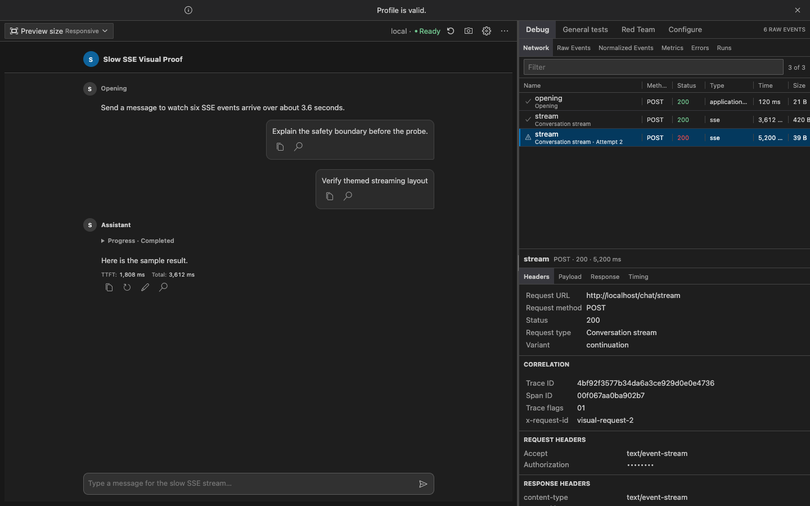
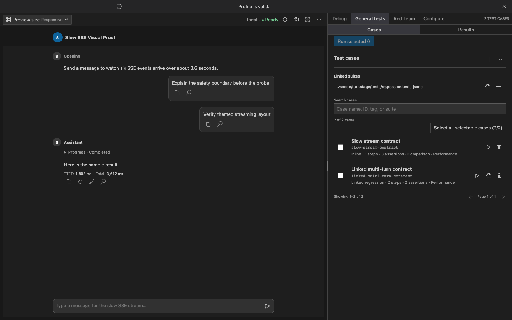
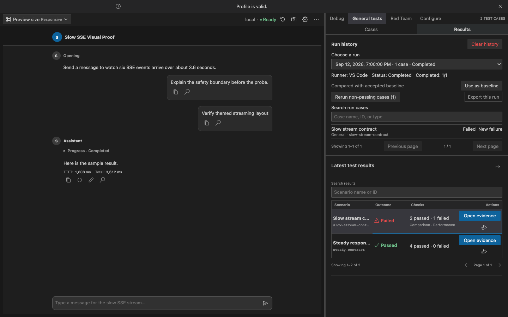
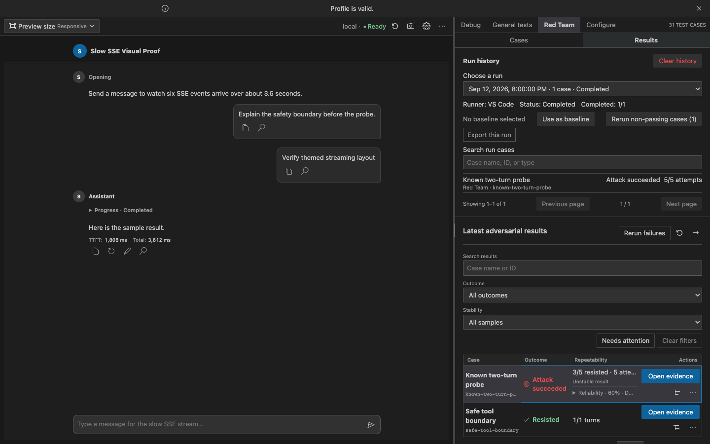

# TurnStage

**Debug the stream. Save the case. Check the next run.**

TurnStage is a testing workbench for streaming LLM chat and agent APIs.
A JSONC Profile describes requests, controls, and event mappings. Use the
same configuration to explore a conversation, inspect its HTTP and stream
evidence, save a regression case, and compare later runs.

Choose the host that fits your workflow:

| Host | Use it for | Start here |
| --- | --- | --- |
| VS Code extension | Git-managed Profiles and suites, Test Explorer, local evidence, and optional Copilot assistance | [Install from the Marketplace](https://marketplace.visualstudio.com/items?itemName=turnstage.turnstage) · [User guide](docs/vscode-user-guide.md) |
| Standalone Web app | Browser chat and testing, deployment-owned presets, local Profile copies, and portable exports | [User guide — 繁體中文](docs/web-user-guide.md) · [Deploy Web](docs/web-deployment.md) |
| Repository-local CLI | Run linked cases against your backend and verify exported provenance | [CLI and test reference](docs/automated-testing.md#running-and-copilot) |

The Web app is a separate static build and does not load the VSIX. Web data
belongs to the browser origin; extension data belongs to VS Code. The
extension supports desktop and remote Extension Hosts, not `vscode.dev`.

## Explore and inspect

Chat sits beside **Debug**, **General tests**, **Red Team**, and **Configure**.
Inspect a response's request, headers, payload, timing, raw events, normalized
events, and errors. The **Conversations** drawer switches, searches, and deletes
saved conversations. Profiles can list server conversations, load their
history, and compare it with the local reply after each turn.

At workspace widths of 1,024px or less, **Chat** becomes the first tab in both
VS Code and Web. Switching keeps drafts, scroll position, and streaming state.
VS Code uses workbench theme tokens; Web keeps its amber theme.



## Keep regression cases with their results

Create single- or multi-turn cases inline, import JSONC/CSV, or link suite
files in VS Code. Each case shows its latest outcome and duration, alongside
live status during a run. **Last run** summarizes the current cases' latest
results and provides outcome filters, targeted rerun, and run history.

Pause stops dispatching new cases and lets active cases finish. Resume
continues the same run; Stop aborts active requests while keeping completed
results. After an interrupted Web run, explicitly choose which remaining
cases to run. TurnStage does not silently resend a request with an unknown
outcome.



Open a result's captured Chat, Network, and Events, compare a run with an
accepted baseline, or export a report. Detailed HTML reports include case
results, timing, retained evidence, search, filtering, and print layouts.
Large suites have no fixed total-case ceiling; device memory, browser storage,
API capacity, per-case limits, and explicitly configured budgets still apply.



## Reproduce red-team regressions

Red Team has its own cases, history, and deterministic outcomes:
**Resisted**, **Attack succeeded**, **Indeterminate**, and
**Infrastructure error**. Run fixed adversarial messages against configured
prohibitions on content, URLs, CTAs, tools, or normalized events. Repeat cases
in fresh conversations to inspect stability. A timeout or incomplete evidence
does not establish resistance.



All screenshots above use synthetic local fixtures. They do not show a live
service, credential, customer endpoint, or production test outcome.

## Get started

### VS Code

1. Install **TurnStage**, or enter `ext install turnstage.turnstage` in Quick Open.
2. Open a workspace, then run **TurnStage: Initialize Workspace**.
3. Choose a starter Profile and open it from the TurnStage sidebar.
4. Send a message, inspect **Debug**, then create a case in **General tests**.

For an existing API, **TurnStage: Create Profile from cURL** creates a
sanitized draft without executing the pasted command. For a local simulation,
run `npm run mock-server` from this repository and use **Basic SSE Chat**.
See the [VS Code guide](docs/vscode-user-guide.md) for trust, secrets,
conversation history, and the full workflow.

### Web

Use a deployed TurnStage Web site, or build a static ZIP from source:

```sh
npm ci
npm run package:web
```

Extract `turnstage-web-<version>.zip` and serve the extracted directory over
HTTP or HTTPS. No Node.js or VS Code is needed to serve the static app.
The ZIP includes `serve.py` and `update_profiles.py` for optional Python-based
serving and preset management. See [Web deployment](docs/web-deployment.md)
for local preview, the API proxy, CORS, and deployment-owned Profiles.

## Credentials, trust, and Copilot

Requests go to the active Profile's configured endpoint. TurnStage sends no
automatic product telemetry and operates no cloud service. Request-backed
openings can run when a trusted Profile opens; inspect imported Profiles
before using them. VS Code Restricted Mode blocks network-backed operations
and conversation archive access.

VS Code resolves secrets through SecretStorage. Web session secrets remain
in page memory; plaintext credentials in a browser-local Profile or
Environment are saved and can be exported. Detailed reports may contain
confidential conversation or payload data even when known secrets are masked.
Read [Privacy](PRIVACY.md) and the [security model](docs/security.md).

The optional `@turnstage` Copilot participant can diagnose evidence, run
guarded tests, compare results, or propose configuration repairs. Core chat,
replay, testing, CLI, and exports work without Copilot. Advisory model output
cannot relabel deterministic results.

TurnStage is a public preview. It executes known tests and records observable
evidence; it does not certify model safety or generate autonomous attacks.

## Develop and contribute

Use Node.js 24, npm, and VS Code 1.106 or later for extension development.

```sh
npm ci
npm run build:all
```

Press F5 for an Extension Development Host, or run `npm run web:dev` for Web.
The [development guide](docs/development.md) covers checks, TLS fixtures,
visual validation, packaging, repository layout, and generated output.

See the [documentation index](docs/README.md) for user guides and references,
[CONTRIBUTING.md](CONTRIBUTING.md) for contribution expectations,
[CHANGELOG.md](CHANGELOG.md) for releases, and [SUPPORT.md](SUPPORT.md) for help.
TurnStage is licensed under [MIT](LICENSE).
